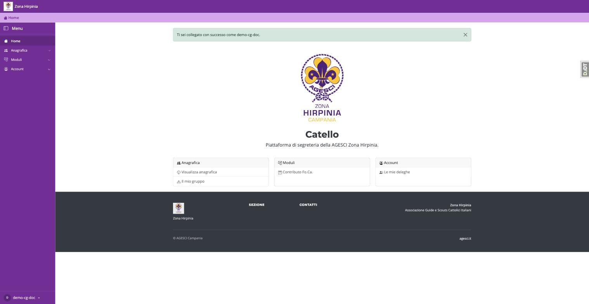
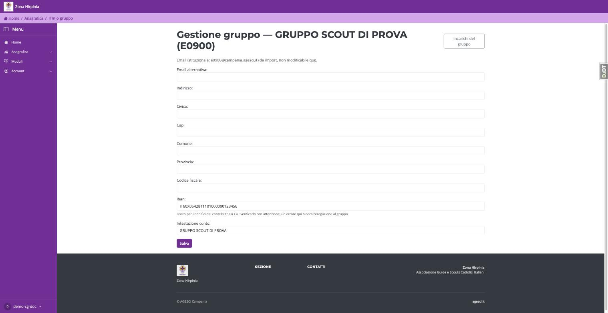
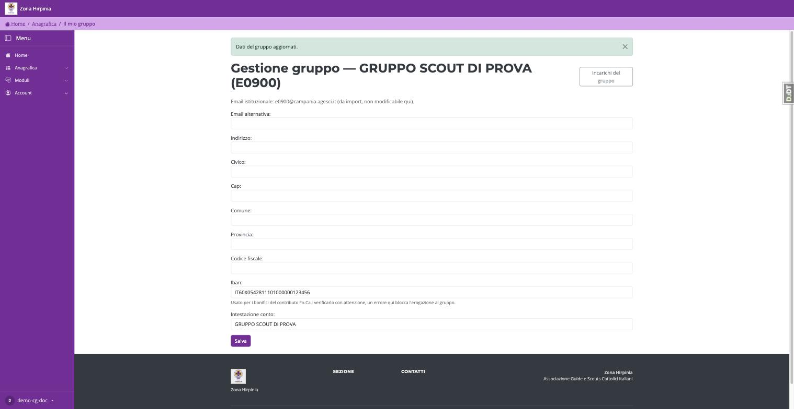

# IBAN e intestazione conto del gruppo

Il contributo Fo.Ca. viene erogato al gruppo tramite bonifico bancario: perché
la segreteria di Zona possa pagarlo, il gruppo deve avere un IBAN valido
registrato su Catello.

## Dove si trova

1. Accedi con l'account del tuo gruppo.
2. Dal menu, apri **Anagrafica → Il mio gruppo**.

Si apre la pagina "Gestione gruppo", con i dati anagrafici del gruppo e, in
fondo, i campi **Iban** e **Intestazione conto**.

## Come compilarli

1. Nel campo **Iban**, scrivi l'IBAN del conto del gruppo, senza spazi.
2. Nel campo **Intestazione conto**, scrivi il nome a cui è intestato il
   conto (di norma il nome del gruppo).
3. Premi **Salva**.

Se tutto è corretto, vedrai il messaggio "Dati del gruppo aggiornati" in cima
alla pagina.

!!! warning "Verifica l'IBAN con attenzione"
    Un IBAN sbagliato o mancante **blocca il bonifico** al momento della
    liquidazione del contributo: il gruppo non riceve l'accredito finché
    l'IBAN non viene corretto. Ricontrolla ogni carattere prima di salvare.

Se inserisci un IBAN con un formato non valido (lunghezza sbagliata, caratteri
non ammessi, codice paese sconosciuto), Catello rifiuta il salvataggio e
mostra un messaggio di errore sotto il campo, senza salvare nulla: correggi il
valore e premi di nuovo **Salva**.

## Altri campi di questa pagina

Nella stessa pagina puoi aggiornare anche indirizzo, comune, provincia, CAP,
codice fiscale del gruppo ed email alternativa. L'email istituzionale del
gruppo, invece, non è modificabile da qui: arriva automaticamente
dall'autorizzazione di Zona.
