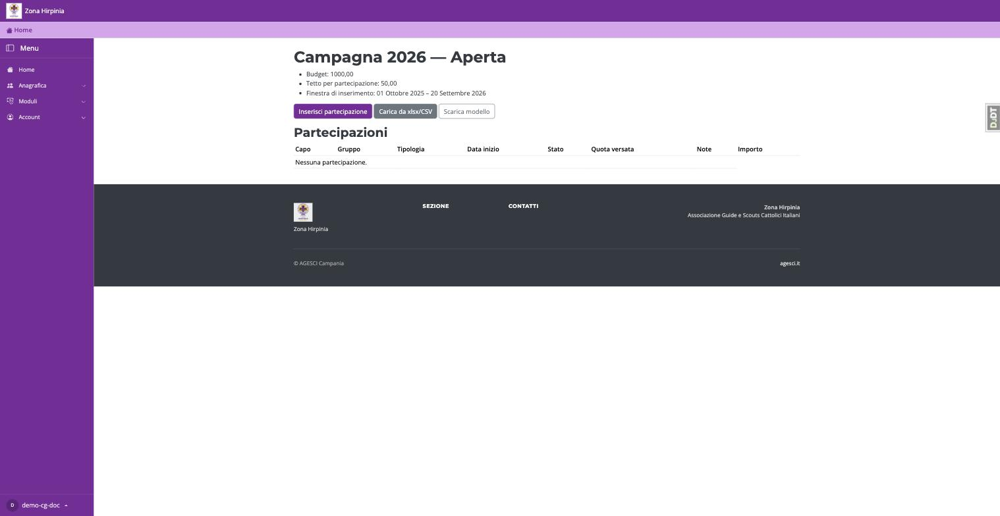
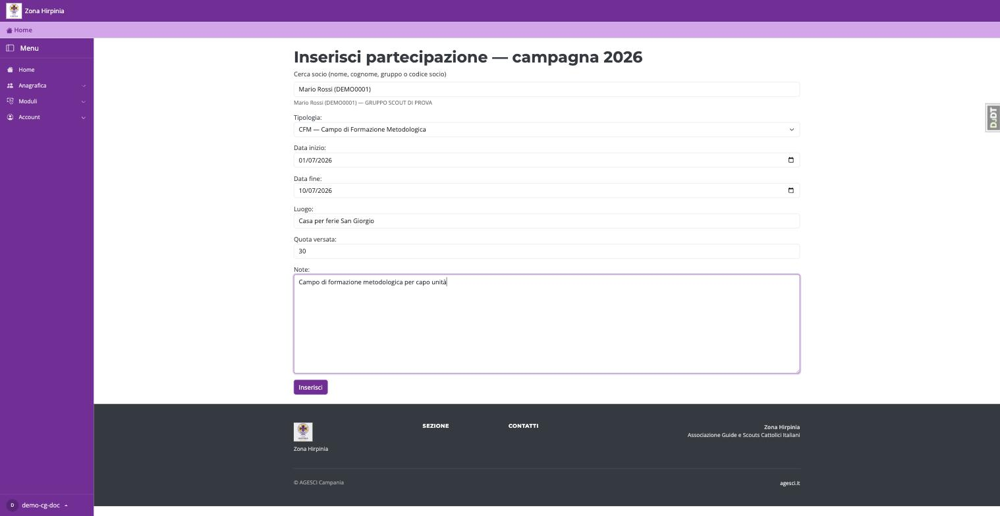
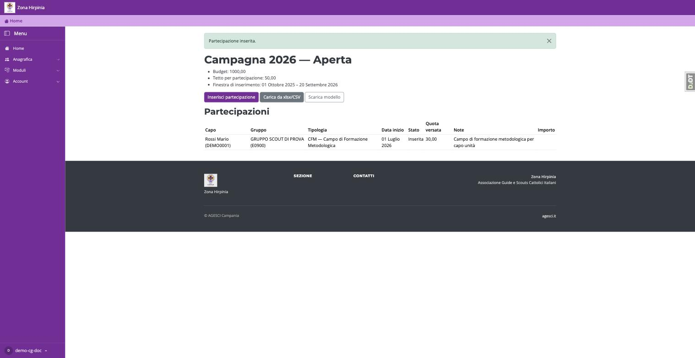

# Partecipazione al contributo Fo.Ca.

Il contributo Fo.Ca. (Formazione Capi) rimborsa, entro un tetto per
partecipazione, la quota versata dai capi del tuo gruppo per campi di
formazione. Per ottenerlo, ogni partecipazione va registrata su Segreteria AGESCI Hirpinia
durante la finestra di inserimento della campagna dell'anno.

Puoi registrare le partecipazioni in due modi: **una alla volta** (più comodo
per pochi casi) oppure **caricando un file** con più partecipazioni insieme
(più comodo se il gruppo ha più capi da inserire).

## Aprire la campagna

1. Dal menu, apri **Moduli → Contributo Fo.Ca.**
2. Clicca sull'anno della campagna aperta (in genere l'unica proposta).

In cima alla pagina vedi budget, tetto massimo per partecipazione e finestra
di inserimento consentita: fuori da questa finestra la piattaforma non accetta nuove
partecipazioni.

## Inserire una partecipazione singola

1. Clicca **Inserisci partecipazione**.
2. Nel campo di ricerca, digita almeno 2 caratteri del nome, cognome o codice
   socio del capo e seleziona il nominativo dall'elenco che compare.
3. Compila tipologia del campo (CFM, CFA, CCG o Altro), data di inizio e fine,
   luogo, quota versata dal capo e — se serve — una nota.
4. Clicca **Inserisci**.

La partecipazione compare subito nell'elenco della campagna, con stato
"Inserita": l'importo effettivo del contributo viene calcolato dalla
segreteria di Zona più avanti, quando la campagna viene valutata e chiusa —
non è un'operazione che il gruppo deve fare.

!!! tip "Il capo non compare nella ricerca?"
    La ricerca mostra solo i capi censiti nel tuo gruppo per l'anno in corso.
    Se un capo si è appena trasferito o non risulta ancora censito, contatta
    la segreteria di Zona prima di inserire la partecipazione.

## Caricare più partecipazioni insieme

Se devi inserire diverse partecipazioni, puoi caricare un file invece di
ripetere il form per ognuna:

1. Dalla stessa pagina della campagna, clicca **Scarica modello** per
   ottenere il file xlsx con le colonne già pronte.
2. Compila una riga per ogni partecipazione (stessi dati del form singolo:
   capo, tipologia, date, luogo, quota versata).
3. Clicca **Carica da xlsx/CSV** e seleziona il file compilato.
4. La piattaforma mostra un'**anteprima** delle righe da importare, segnalando eventuali
   errori (es. un capo non trovato, una data fuori campagna): correggi il file
   e ricaricalo se necessario.
5. Solo dopo aver confermato l'anteprima le partecipazioni vengono
   effettivamente registrate — fino a quel momento nessun dato viene salvato.

!!! warning "Un file caricato per errore"
    Se nell'anteprima noti righe sbagliate, non confermare l'importazione:
    correggi il file e ricaricalo. Una volta confermato, per correggere una
    singola partecipazione dovrai farlo a mano dall'elenco della campagna.
